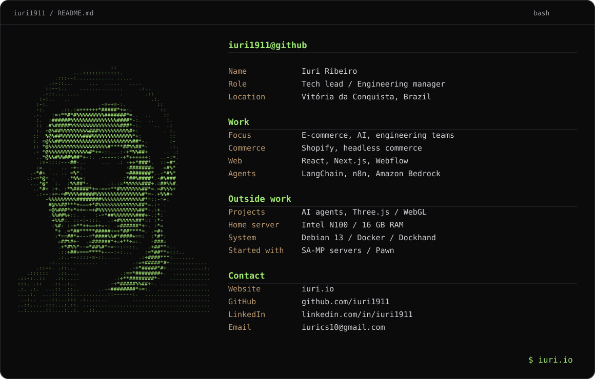

[Website](https://iuri.io) · [LinkedIn](https://www.linkedin.com/in/iuri1911) · [Email](mailto:iurics10@gmail.com)

Profile and tools

Tech lead / Engineering manager. Vitória da Conquista, Brazil.

- Commerce: [Shopify](https://www.shopify.com), headless commerce.
- Web: [React](https://react.dev), [Next.js](https://nextjs.org), [Webflow](https://webflow.com).
- Agents: [LangChain](https://www.langchain.com), [n8n](https://n8n.io), [Amazon Bedrock](https://aws.amazon.com/bedrock/).
- Projects: AI agents, [Three.js](https://threejs.org) / WebGL.
- Home server: Intel N100, 16 GB RAM, [Debian](https://www.debian.org), [Docker](https://www.docker.com), [Dockhand](https://dockhand.pro).

